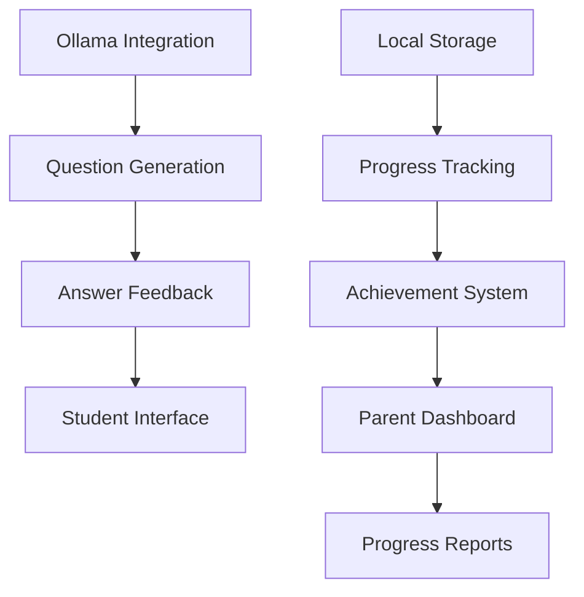

# User Stories for LearningHub AI Platform

This directory contains detailed user stories for the LearningHub AI platform MVP development. All stories are organized by epic and prioritized for a 2-week development timeline.

## Epic Overview

### Epic 1: AI-Powered Question Generation (13 story points)

**Sprint:** 1 (Days 1-4)  
**Status:** Critical (P0)

| Story ID  | Title                            | Points | Priority | Sprint |
| --------- | -------------------------------- | ------ | -------- | ------ |
| US-QG-001 | Basic Math Question Generation   | 8      | P0       | 1      |
| US-QG-002 | Multiple Choice Question Support | 5      | P0       | 1      |

### Epic 2: Evaluation and Feedback System (18 story points)

**Sprint:** 1-2 (Days 1-8)  
**Status:** Critical to High Priority

| Story ID  | Title                              | Points | Priority | Sprint |
| --------- | ---------------------------------- | ------ | -------- | ------ |
| US-EV-001 | Immediate Answer Feedback          | 5      | P0       | 1      |
| US-EV-002 | Step-by-Step Solution Explanations | 8      | P1       | 2      |

### Epic 3: Progress Tracking and Analytics (13 story points)

**Sprint:** 2-3 (Days 5-12)  
**Status:** High to Medium Priority

| Story ID  | Title                   | Points | Priority | Sprint |
| --------- | ----------------------- | ------ | -------- | ------ |
| US-PT-001 | Basic Progress Tracking | 5      | P1       | 2      |
| US-PT-002 | Achievement System      | 8      | P2       | 3      |

### Epic 4: Student Interface (13 story points)

**Sprint:** 1-2 (Days 1-8)  
**Status:** Critical Priority

| Story ID  | Title                         | Points | Priority | Sprint |
| --------- | ----------------------------- | ------ | -------- | ------ |
| US-SI-001 | Child-Friendly Math Interface | 8      | P0       | 1      |
| US-SI-002 | Touch-Optimized Answer Input  | 5      | P0       | 2      |

### Epic 5: Parent Dashboard (13 story points)

**Sprint:** 3-4 (Days 9-14)  
**Status:** High to Medium Priority

| Story ID  | Title                   | Points | Priority | Sprint |
| --------- | ----------------------- | ------ | -------- | ------ |
| US-PD-001 | Basic Parent Dashboard  | 8      | P1       | 3      |
| US-PD-002 | Weekly Progress Reports | 5      | P2       | 4      |

### Epic 6: System Integration (8 story points)

**Sprint:** 1 (Days 1-4)  
**Status:** Critical Priority

| Story ID  | Title                  | Points | Priority | Sprint |
| --------- | ---------------------- | ------ | -------- | ------ |
| US-SI-001 | Local Data Storage     | 5      | P0       | 1      |
| US-SI-002 | Ollama LLM Integration | 3      | P0       | 1      |

## Sprint Breakdown

### Sprint 1 (Days 1-4) - Foundation Sprint

**Total: 34 story points**

-   Core question generation and AI integration
-   Basic student interface and answer feedback
-   Local data storage and Ollama setup

**Critical Path:**

1. Ollama LLM Integration (US-SI-002) - 3 pts
2. Local Data Storage (US-SI-001) - 5 pts
3. Basic Math Question Generation (US-QG-001) - 8 pts
4. Child-Friendly Math Interface (US-SI-001) - 8 pts
5. Multiple Choice Question Support (US-QG-002) - 5 pts
6. Immediate Answer Feedback (US-EV-001) - 5 pts

### Sprint 2 (Days 5-8) - User Experience Sprint

**Total: 18 story points**

-   Enhanced student interactions and explanations
-   Progress tracking foundation

**Focus Areas:**

1. Touch-Optimized Answer Input (US-SI-002) - 5 pts
2. Step-by-Step Solution Explanations (US-EV-002) - 8 pts
3. Basic Progress Tracking (US-PT-001) - 5 pts

### Sprint 3 (Days 9-12) - Engagement Sprint

**Total: 16 story points**

-   Achievement system and parent dashboard

**Deliverables:**

1. Achievement System (US-PT-002) - 8 pts
2. Basic Parent Dashboard (US-PD-001) - 8 pts

### Sprint 4 (Days 13-14) - Polish Sprint

**Total: 5 story points**

-   Email notifications and final integration

**Final Features:**

1. Weekly Progress Reports (US-PD-002) - 5 pts

## Priority Legend

-   **P0 (Critical):** Must-have for MVP launch
-   **P1 (High):** Important for user experience
-   **P2 (Medium):** Nice-to-have, can be moved to post-MVP

## Story Point Estimation

-   **1-3 points:** Simple task, 1-4 hours
-   **5 points:** Medium complexity, 1-2 days
-   **8 points:** Complex feature, 2-3 days
-   **13+ points:** Epic-level, needs breakdown

## File Organization

Each user story follows this structure:

```
epic-##-epic-name/
  ├── story-01-feature-name.md
  ├── story-02-feature-name.md
  └── ...
```

## Dependencies Map



## Success Criteria for MVP

### Technical Criteria

-   [ ] All P0 stories completed (42 story points)
-   [ ] Platform works offline with local LLM
-   [ ] Grade 3 math questions generate in <3 seconds
-   [ ] Student data persists locally
-   [ ] Touch interface works on tablets

### Educational Criteria

-   [ ] Questions align with NZ Curriculum Level 2-3
-   [ ] Solution explanations are age-appropriate
-   [ ] Progress tracking motivates continued learning
-   [ ] Parent visibility into child's progress

### User Experience Criteria

-   [ ] Students can complete 10 questions in <10 minutes
-   [ ] Interface accessibility meets WCAG 2.1 AA
-   [ ] Zero data loss during normal operation
-   [ ] Parent dashboard provides actionable insights

## Development Notes

### Technology Stack

-   **Frontend:** Angular 20.x with Angular Material
-   **Backend:** NestJS with local-first architecture
-   **Database:** MongoDB (local instance)
-   **AI:** Ollama with llama3.1 model
-   **Search:** OpenSearch for vector operations

### Key Constraints

-   2-week development timeline
-   Solo developer implementation
-   Local-first, privacy-focused design
-   Primary school student target audience (Ages 7-9)

### Testing Strategy

-   Unit tests for all calculation logic
-   Integration tests for AI generation
-   User acceptance testing with target age group
-   Performance testing on target devices (tablets)

---

**Last Updated:** October 18, 2025  
**Total Story Points:** 78  
**Estimated Completion:** 14 days (2 weeks)  
**Target Audience:** Grade 3 students (Ages 7-9) and their parents
